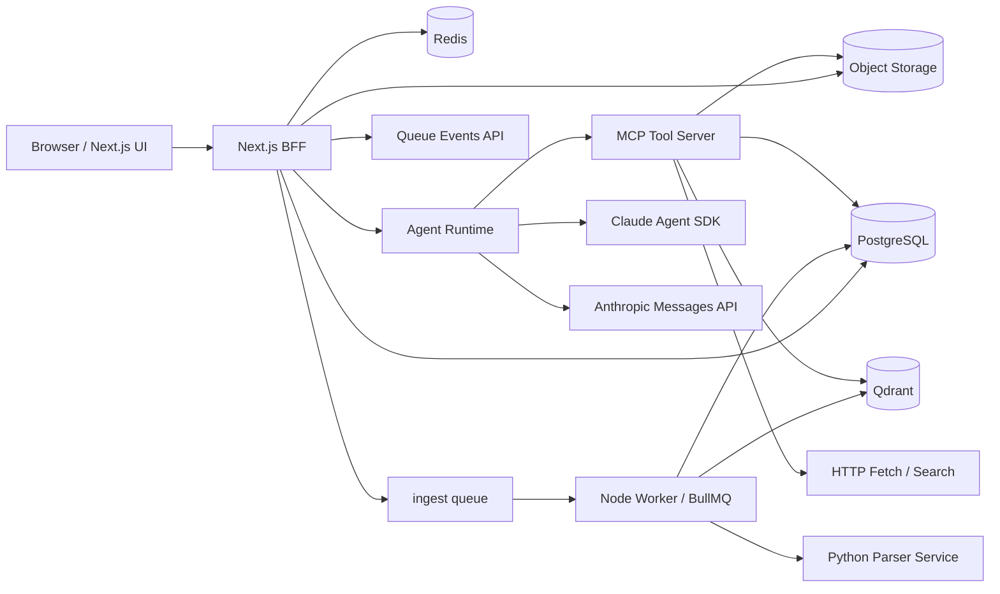

# 通用知识库 Agent 助手技术设计（Node.js / Next.js / Claude Agent SDK）

版本：v0.2  
日期：2026-03-28

> 文档角色说明：
>
> - 本文件是当前实现的架构/技术约束主文档。
> - 当前阶段进度、活跃待办和下一步顺序请看 [implementation-tracker.md](/Users/fan/project/tmp/law-doc/docs/implementation-tracker.md)。
> - 本地开发启动、Docker 依赖和日常操作请看 [development-setup.md](/Users/fan/project/tmp/law-doc/docs/development-setup.md)。
> - 若与其他支持性文档冲突，以本文件为准。

## 1. 已确认约束

- 产品定位是“通用工作空间知识库助手”，不是法律垂类产品。
- 仍保留一个专项的“法律条文搜索”工具，用于需要法规引用的任务。
- 主站和主后端使用 Node.js。
- Web 框架使用 Next.js。
- 文档解析允许使用 Python。
- Agent 决策与规划固定使用 `@anthropic-ai/claude-agent-sdk`。

第一版产品核心：

- 单用户账号体系
- 工作空间级知识库
- 工作空间级会话与报告
- 支持按目录组织资料
- 上传后异步消化
- 基于 MD5/SHA256 的解析缓存
- 基于资料库的带引用问答
- 可选联网补充搜索

## 2. 技术栈

- Web + BFF：`Next.js 16 App Router`
- 认证：`Auth.js`
- 数据库：`PostgreSQL`
- ORM：`Drizzle ORM`
- 队列与缓存：`Redis + BullMQ`
- 对象存储：`S3 Compatible`（开发期可用 MinIO）
- 向量检索：`Qdrant`
- Agent 规划：`@anthropic-ai/claude-agent-sdk`
- 最终答案结构化输出：`@anthropic-ai/sdk`
- 文档解析：`Python + FastAPI`
- PDF 阅读：`PDF.js`

当前 provider 策略：

- Agent 规划固定 Anthropic
- embedding / rerank 优先 DashScope，未配置时回退本地方案
- OCR 默认关闭，只有扫描件、图片型 PDF 或无文本层材料才启用

## 3. 总体架构



架构原则：

- Next.js 负责 UI 与轻量 BFF，不直接做重计算。
- 长耗时任务都走 BullMQ Worker。
- Agent Runtime 独立成常驻 Node 进程。
- 文档解析放到 Python Parser Service。
- 检索证据和最终生成分层，避免把所有责任压给 Agent SDK。

## 4. 运行时分层

### 4.1 Next.js BFF

负责：

- 页面渲染
- 登录态
- 上传签名
- 任务查询
- 创建对话
- SSE 推流

不负责：

- OCR
- 向量化
- Agent 长循环
- 重报告生成

### 4.2 BullMQ Worker

负责：

- 上传后的异步处理
- 文档切块与入库
- embedding / rerank 调用
- 报告导出

### 4.3 Agent Runtime

负责：

- 多步任务规划和工具调用
- 管理会话 session
- 控制不同模式下的 `allowedTools`
- 组织问答、研究和写作流程

### 4.4 Python Parser Service

负责：

- 文本抽取
- OCR
- 表格和版面结构恢复
- 页码与坐标映射

## 5. 代码组织

```text
.
├─ apps/
│  ├─ web/
│  ├─ worker/
│  └─ agent-runtime/
├─ services/
│  └─ parser/
├─ packages/
│  ├─ db/
│  ├─ contracts/
│  ├─ queue/
│  ├─ storage/
│  ├─ retrieval/
│  ├─ agent-tools/
│  └─ auth/
└─ docs/
```

## 6. 数据与检索

核心对象：

- `users`
- `workspaces`
- `documents`
- `document_versions`
- `document_jobs`
- `document_pages`
- `document_blocks`
- `document_chunks`
- `citation_anchors`
- `conversations`
- `messages`
- `message_citations`
- `reports`
- `report_sections`
- `retrieval_runs`
- `retrieval_results`

文档类型采用通用 taxonomy：

- `reference`
- `guide`
- `policy`
- `spec`
- `report`
- `note`
- `email`
- `meeting_note`
- `other`

检索原则：

- 工作空间是最小隔离边界。
- 目录树只影响过滤和展示，不改变底层 chunk 平铺索引。
- 回答引用落到 `citation_anchors`。

## 7. Tool 设计

当前工具集合：

- `search_workspace_knowledge`
- `read_citation_anchor`
- `search_web_general`
- `fetch_source`
- `create_report_outline`
- `write_report_section`
- `search_statutes`

说明：

- `search_statutes` 是保留的专项工具，用于法律条文或法规引用场景。
- 其他工具和主流程都以通用知识库助手为中心组织。

## 8. 当前阶段关注点

优先级统一以 [implementation-tracker.md](/Users/fan/project/tmp/law-doc/docs/implementation-tracker.md) 为准。当前重点仍然是：

1. parser 真实 OCR provider
2. sparse/BM25 混合检索
3. grounded answer 与证据展示
4. SSE 工具时间线
